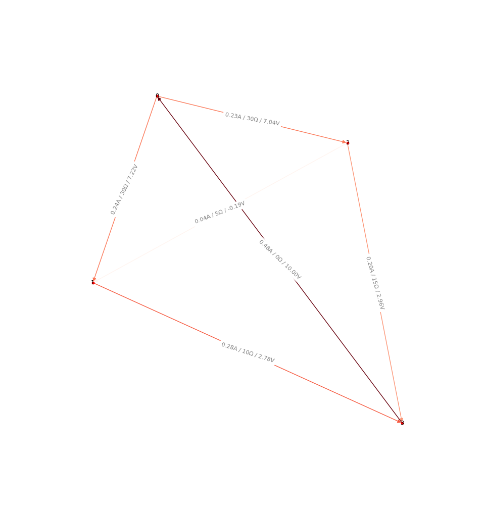

<hr>
MOWNIT 2 (12.03.2019)<br>
Maciej Mionskowski | nr albumu: 296628
<hr>

# II Laboratoria

## Gauss Jordan

Usprawnienia względem standardowego algorytmu:

- Complete/Full pivoting
- Scaling

### Porównanie

Size | Our gauss Jordan | Numpy solve
---|---|---
5 | 0.0006504058837890625 | 0.0000858306884765
300 | 0.35778236389160156 | 0.06560730934143066
1000 | 7.49634051322937 |   0.2636873722076416

### Wnioski

Gauss Jordan nie jest zbyt efektywnym algorytmem rozwiązywania układów równań.
Funkcje biblioteczne są rząd wielkości szybsze.

## LU Decomposition

Zgodnie z instrukcjami podanymi na laboratoriach zrezygnowałem z pivotingu i scalingu.

### Porównanie

Size | Our LU Decomp | Scipy LU Decom
---|---|---
5 | 0.00011491775512695312 | 0.0010249614715576173
10 | 0.0002892017364501953 | 0.0021255016326904297
300 | 0.2748112678527832 | 0.19040608406066895
1000 | 3.4280920028686523 | 0.35529518127441406
2000 | 14.292314529418945 | 1.0336315631866455

### Wnioski

Dla bardzo niewielkich macierzy nasz algorytm dekompozycji potrafi być szybszy niż ten zawarty w bibliotece scipy.
Dla obszerniejszych danych scipy jest znacznie wydajniejszy.

## Circuit Analysis

Do analizy obwodu zastosowałem mesh analysis oparty na prawach Kirchoffa.

### Dokładniejszy opis algorytmu

0. Zaczynam z grafem nieskierowanym, w którym wagi są oporem
1. W grafie wyszukiwany jest kernel cykli/cykle bazowe (cycle_basis).
2. Każdej krawędzi przypisuję listę cykli, do których należy, a także kierunek przepływu prądu dla danego cyklu
3. Tworzę macierz MxM, gdzie M to liczba cykli bazowych w grafie, wypełniam ją sumą oporu w całym cyklu +/- oporami z cykli powiązanych z krawędziami w cyklu macierzystym. 
Jest to układ równań oparty na II. prawie Kirchoffa
4. Rozwiązując układ dostaję przepływ prądu w danym oczku (cyklu)
5. Wyliczam przepływ prądu i spadek napięcia na każdej krawędzi z prawa Ohma i wyliczonej macierzy.

Następnie dla wygody:
- Zamieniam graf na skierowany i ustalam kierunek krawędzi.
- Weryfikuję kalkulacje poprzez sprawdzenie z I prawa Kirchoffa prądy wychodzące i wchodzące dla każdego węzła:
```python
    for node in gr.nodes():
        current_in = sum([gr.edges[in_edge]['current'] for in_edge in gr.in_edges(node)])
        current_out = sum([gr.edges[in_edge]['current'] for in_edge in gr.out_edges(node)])

        if abs(current_in - current_out) > eps:
            return False

    return True
```

### Użycie

Wczytanie pliku z krawędziami w formacie `from, to, resistance` (rezystancja krawędzi)
i ostatnią linią `from, to, voltage` (przyłożenie napięcia)
```python
./circuit_analysis.py graphs/cubic.txt
```

Wygenerowanie losowego grafu:
```python
./circuit_analysis.py > new_graph.txt
```

### Przykłady

#### Prosty graf spójny



#### Dwa grafy spójne połączone mostem
Napięcie zostało przyłożone między wierzchołkami 0 a 98
Mostek znajduje się między 49 a 50


#### Graf 3-regularny (kubiczny)

Napięcie zostało przyłożone między wierzchołkiem 0 a 13, gdzie graf przestał być 3-regularny.


#### Graf siatka 2D

Napięcie przyłożone między (0,0), a (3,0) 10V


#### Complete graph

