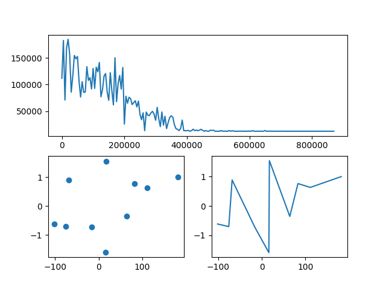
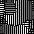
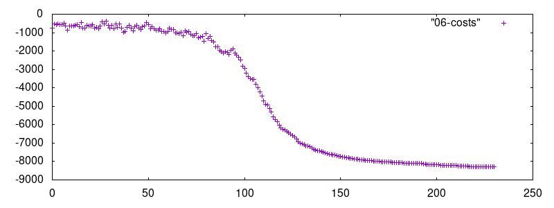

Maciej Mionskowski - 296628

---

# TSP

- Użyto schematu metropolisa
- W celu przyspieszenia wyżarzania funkcja obliczania kosztu dla nowego stanu działa in-place, nowy stan tworzony się dopiero po jego zaakceptowaniu
- Funkcja kosztu to suma kwadratów odległości między punktami, dzięki czemu algorytm penalizuje długie ścieżki, a dodatkowo odczuwalny jest zysk wydajnościowy
- Wartość początkowa temperatury i funkcja temperatury zostały dobrane empirycznie
    - dla normal i uniform distribution: `T0 = cost(initial_state) / math.log10(n)`
    - dla *clustered* distribution: `T0 = cost(points) * n`
    - Tn+1 = Tn/1.00001

Można zauważyć, że algorytm nie jest idealny, nie udało mi się dojść do takiego stanu, by funkcje były całkowicie poprawnie minimalizowne.

### Consecutive swap vs arbitrary swap

Przy consecutive swap minimalizacja zwykle kończyła się dużo gorszym wynikiem niż przy arbitrary swap.
Tuning parametrów niewiele zmienił w tej kwestii.
np.

## Uniform distribution

### 100 points

### 10 points

### 30 points

## Normal distribution

### 100 points

### 10 points

### 30 points

## Clustered distribution

### 18 points

### 45 points

### 90 points

# Binary Image

## Poczynione optymalizacje

- lokalne przeliczanie zmian energii
- leniwe generowanie nowych stanów (dopiero po akceptacji)

## Wyniki

### 8-sąsiedztwo

### 16-sąsiedztwo podnoszące energię - 8-sąsiedztwo obniżające energię

||||||
|---|---|---|---|---|
|+1|+1|+1|+1|+1|
|+1|-1|-1|-1|+1|
|+1|-1|0|-1|+1|
|+1|-1|-1|-1|+1|
|+1|+1|+1|+1|+1|

# Sudoku

## Opis:

- Schemat metropolisa jako funkcja prawdopodobieństwa akceptacji stanu o wyższej energii/niższym scorze.
- Score jest obliczany jako liczba unikalnych liczb w każdym wierszu i kolumnie. Score = 162 => sudoku rozwiązane
- Geometryczne wyżarzanie, gdzie Tn+1 = Tn/1.00002, a T0 = 1/2

Powyższe parametry dobrano poprzez fine tuning. Dla pewnych problemów wskazana byłaby wyższa temperatura bądź wolniejsze wyżarzanie.
Podjęto próby np. zwiększania temperatury początkowej przy restarcie, jednak nie przyniosło to pozytywnych efektów.

## Algorytm

1. Wczytany problem jest reshapowany na macierz (3,3,3,3), gdzie:
    - 1dim określa wiersz wewnętrznego segmentu 9x9,
    - 2dim określa kolumnę wewnętrznego segmentu 9x9,
    - 3dim określa wiersz wpisanej cyfry w segmencie,
    - 4dim określa kolumnę wpisanej cyfry.
2. Puste miejsca w każdym segmencie populowane są liczbami, które w nim nie występują, w sposób losowy.
3. Dopóki sudoku nie jest rozwiązane:
    - wygeneruj nowy stan poprzez wybranie losowego segmentu i dwóch losowych pól(które nie miały wpisanej wartości na początku) w tym segmencie
    - jeśli `score` nowego stanu nie zmieni się o więcej niż 4 podczas ostatnich 50000 iteracji, zrestartuj rozwiązywanie
    - zastosuj standardowy algorytm symulowanego wyżarzania (podmień stan, obniż temperaturę, etc.)
    
## Wnioski
Algorytm jest w stanie poradzić sobie z każdą zagadką.
Dla paczki 11 najtrudniejszych sudoku:

Średnio:
- Dla pomyślnego przebiego potrzebowano *13 485 909* iteracji
- Restartowano algorytm *9 razy*
- Co daje łącznie *121 373 145* iteracji na jedno najtrudniejsze sudoku.

Algorytm poradził sobie również ze zbiorem 50 sudoku o różnym stopniu trudności.

## Hardest #1

### Puzzle 

||||||||||
|:---:|:---:|:---:|:---:|:---:|:---:|:---:|:---:|:---:|
| 8 | 5 | . | . | . | 2 | 4 | . | . |
| 7 | 2 | . | . | . | . | . | . | 9 |
| . | . | 4 | . | . | . | . | . | . |
| . | . | . | 1 | . | 7 | . | . | 2 |
| 3 | . | 5 | . | . | . | 9 | . | . |
| . | 4 | . | . | . | . | . | . | . |
| . | . | . | . | 8 | . | . | 7 | . |
| . | 1 | 7 | . | . | . | . | . | . |
| . | . | . | . | 3 | 6 | . | 4 | . |

 ## Solution 

||||||||||
|:---:|:---:|:---:|:---:|:---:|:---:|:---:|:---:|:---:|
| 8 | 5 | 9 | 6 | 1 | 2 | 4 | 3 | 7 |
| 7 | 2 | 3 | 8 | 5 | 4 | 1 | 6 | 9 |
| 1 | 6 | 4 | 3 | 7 | 9 | 5 | 2 | 8 |
| 9 | 8 | 6 | 1 | 4 | 7 | 3 | 5 | 2 |
| 3 | 7 | 5 | 2 | 6 | 8 | 9 | 1 | 4 |
| 2 | 4 | 1 | 5 | 9 | 3 | 7 | 8 | 6 |
| 4 | 3 | 2 | 9 | 8 | 1 | 6 | 7 | 5 |
| 6 | 1 | 7 | 4 | 2 | 5 | 8 | 9 | 3 |
| 5 | 9 | 8 | 7 | 3 | 6 | 2 | 4 | 1 |

### Annealing schema:

Restarts: 1

Iterations: 19805000

------

## Hardest #2

### Puzzle 

||||||||||
|:---:|:---:|:---:|:---:|:---:|:---:|:---:|:---:|:---:|
| . | . | 5 | 3 | . | . | . | . | . |
| 8 | . | . | . | . | . | . | 2 | . |
| . | 7 | . | . | 1 | . | 5 | . | . |
| 4 | . | . | . | . | 5 | 3 | . | . |
| . | 1 | . | . | 7 | . | . | . | 6 |
| . | . | 3 | 2 | . | . | . | 8 | . |
| . | 6 | . | 5 | . | . | . | . | 9 |
| . | . | 4 | . | . | . | . | 3 | . |
| . | . | . | . | . | 9 | 7 | . | . |

 ## Solution 

||||||||||
|:---:|:---:|:---:|:---:|:---:|:---:|:---:|:---:|:---:|
| 1 | 4 | 5 | 3 | 2 | 7 | 6 | 9 | 8 |
| 8 | 3 | 9 | 6 | 5 | 4 | 1 | 2 | 7 |
| 6 | 7 | 2 | 9 | 1 | 8 | 5 | 4 | 3 |
| 4 | 9 | 6 | 1 | 8 | 5 | 3 | 7 | 2 |
| 2 | 1 | 8 | 4 | 7 | 3 | 9 | 5 | 6 |
| 7 | 5 | 3 | 2 | 9 | 6 | 4 | 8 | 1 |
| 3 | 6 | 7 | 5 | 4 | 2 | 8 | 1 | 9 |
| 9 | 8 | 4 | 7 | 6 | 1 | 2 | 3 | 5 |
| 5 | 2 | 1 | 8 | 3 | 9 | 7 | 6 | 4 |

### Annealing schema:

Restarts: 11

Iterations: 7550000

------

## Hardest #3

### Puzzle 

||||||||||
|:---:|:---:|:---:|:---:|:---:|:---:|:---:|:---:|:---:|
| 1 | 2 | . | . | 4 | . | . | . | . |
| . | . | 5 | . | 6 | 9 | . | 1 | . |
| . | . | 9 | . | . | . | 5 | . | . |
| . | . | . | . | . | . | . | 7 | . |
| 7 | . | . | . | 5 | 2 | . | 9 | . |
| . | 3 | . | . | . | . | . | . | 2 |
| . | 9 | . | 6 | . | . | . | 5 | . |
| 4 | . | . | 9 | . | . | 8 | . | 1 |
| . | . | 3 | . | . | . | 9 | . | 4 |

 ## Solution 

||||||||||
|:---:|:---:|:---:|:---:|:---:|:---:|:---:|:---:|:---:|
| 1 | 2 | 8 | 5 | 4 | 7 | 6 | 3 | 9 |
| 3 | 4 | 5 | 8 | 6 | 9 | 2 | 1 | 7 |
| 6 | 7 | 9 | 2 | 1 | 3 | 5 | 4 | 8 |
| 9 | 1 | 2 | 4 | 8 | 6 | 3 | 7 | 5 |
| 7 | 8 | 4 | 3 | 5 | 2 | 1 | 9 | 6 |
| 5 | 3 | 6 | 7 | 9 | 1 | 4 | 8 | 2 |
| 8 | 9 | 1 | 6 | 2 | 4 | 7 | 5 | 3 |
| 4 | 6 | 7 | 9 | 3 | 5 | 8 | 2 | 1 |
| 2 | 5 | 3 | 1 | 7 | 8 | 9 | 6 | 4 |

### Annealing schema:

Restarts: 1

Iterations: 13825000

------

## Hardest #4

### Puzzle 

||||||||||
|:---:|:---:|:---:|:---:|:---:|:---:|:---:|:---:|:---:|
| . | . | . | 5 | 7 | . | . | 3 | . |
| 1 | . | . | . | . | . | . | 2 | . |
| 7 | . | . | . | 2 | 3 | 4 | . | . |
| . | . | . | . | 8 | . | . | . | 4 |
| . | . | 7 | . | . | 4 | . | . | . |
| 4 | 9 | . | . | . | . | 6 | . | 5 |
| . | 4 | 2 | . | . | . | 3 | . | . |
| . | . | . | 7 | . | . | 9 | . | . |
| . | . | 1 | 8 | . | . | . | . | . |

 ## Solution 

||||||||||
|:---:|:---:|:---:|:---:|:---:|:---:|:---:|:---:|:---:|
| 6 | 2 | 4 | 5 | 7 | 8 | 1 | 3 | 9 |
| 1 | 3 | 5 | 4 | 9 | 6 | 8 | 2 | 7 |
| 7 | 8 | 9 | 1 | 2 | 3 | 4 | 5 | 6 |
| 2 | 1 | 6 | 3 | 8 | 5 | 7 | 9 | 4 |
| 8 | 5 | 7 | 9 | 6 | 4 | 2 | 1 | 3 |
| 4 | 9 | 3 | 2 | 1 | 7 | 6 | 8 | 5 |
| 9 | 4 | 2 | 6 | 5 | 1 | 3 | 7 | 8 |
| 5 | 6 | 8 | 7 | 3 | 2 | 9 | 4 | 1 |
| 3 | 7 | 1 | 8 | 4 | 9 | 5 | 6 | 2 |

### Annealing schema:

Restarts: 15

Iterations: 18560000

------

## Hardest #5

### Puzzle 

||||||||||
|:---:|:---:|:---:|:---:|:---:|:---:|:---:|:---:|:---:|
| 7 | . | . | 1 | 5 | 2 | 3 | . | . |
| . | . | . | . | . | . | 9 | 2 | . |
| . | . | . | 3 | . | . | . | . | . |
| 1 | . | . | . | . | 4 | 7 | . | 8 |
| . | . | . | . | . | . | . | 6 | . |
| . | . | . | . | . | . | . | . | . |
| . | . | 9 | . | . | . | 5 | . | 6 |
| . | 4 | . | 9 | . | 7 | . | . | . |
| 8 | . | . | . | . | 6 | . | 1 | . |

 ## Solution 

||||||||||
|:---:|:---:|:---:|:---:|:---:|:---:|:---:|:---:|:---:|
| 7 | 9 | 6 | 1 | 5 | 2 | 3 | 8 | 4 |
| 5 | 3 | 1 | 4 | 6 | 8 | 9 | 2 | 7 |
| 4 | 2 | 8 | 3 | 7 | 9 | 6 | 5 | 1 |
| 1 | 5 | 2 | 6 | 3 | 4 | 7 | 9 | 8 |
| 3 | 8 | 4 | 7 | 9 | 1 | 2 | 6 | 5 |
| 9 | 6 | 7 | 2 | 8 | 5 | 1 | 4 | 3 |
| 2 | 1 | 9 | 8 | 4 | 3 | 5 | 7 | 6 |
| 6 | 4 | 5 | 9 | 1 | 7 | 8 | 3 | 2 |
| 8 | 7 | 3 | 5 | 2 | 6 | 4 | 1 | 9 |

### Annealing schema:

Restarts: 7

Iterations: 31965000

------

## Hardest #6

### Puzzle 

||||||||||
|:---:|:---:|:---:|:---:|:---:|:---:|:---:|:---:|:---:|
| 1 | . | . | . | . | 7 | . | 9 | . |
| . | 3 | . | . | 2 | . | . | . | 8 |
| . | . | 9 | 6 | . | . | 5 | . | . |
| . | . | 5 | 3 | . | . | 9 | . | . |
| . | 1 | . | . | 8 | . | . | . | 2 |
| 6 | . | . | . | . | 4 | . | . | . |
| 3 | . | . | . | . | . | . | 1 | . |
| . | 4 | . | . | . | . | . | . | 7 |
| . | . | 7 | . | . | . | 3 | . | . |

 ## Solution 

||||||||||
|:---:|:---:|:---:|:---:|:---:|:---:|:---:|:---:|:---:|
| 1 | 6 | 2 | 8 | 5 | 7 | 4 | 9 | 3 |
| 5 | 3 | 4 | 1 | 2 | 9 | 6 | 7 | 8 |
| 7 | 8 | 9 | 6 | 4 | 3 | 5 | 2 | 1 |
| 4 | 7 | 5 | 3 | 1 | 2 | 9 | 8 | 6 |
| 9 | 1 | 3 | 5 | 8 | 6 | 7 | 4 | 2 |
| 6 | 2 | 8 | 7 | 9 | 4 | 1 | 3 | 5 |
| 3 | 5 | 6 | 4 | 7 | 8 | 2 | 1 | 9 |
| 2 | 4 | 1 | 9 | 3 | 5 | 8 | 6 | 7 |
| 8 | 9 | 7 | 2 | 6 | 1 | 3 | 5 | 4 |

### Annealing schema:

Restarts: 5

Iterations: 8500000

------

## Hardest #7

### Puzzle 

||||||||||
|:---:|:---:|:---:|:---:|:---:|:---:|:---:|:---:|:---:|
| 1 | . | . | . | 3 | 4 | . | 8 | . |
| . | . | . | 8 | . | . | 5 | . | . |
| . | . | 4 | . | 6 | . | . | 2 | 1 |
| . | 1 | 8 | . | . | . | . | . | . |
| 3 | . | . | 1 | . | 2 | . | . | 6 |
| . | . | . | . | . | . | 8 | 1 | . |
| 5 | 2 | . | . | 7 | . | 9 | . | . |
| . | . | 6 | . | . | 9 | . | . | . |
| . | 9 | . | 6 | 4 | . | . | . | 2 |

 ## Solution 

||||||||||
|:---:|:---:|:---:|:---:|:---:|:---:|:---:|:---:|:---:|
| 1 | 5 | 2 | 9 | 3 | 4 | 6 | 8 | 7 |
| 7 | 6 | 3 | 8 | 2 | 1 | 5 | 4 | 9 |
| 9 | 8 | 4 | 5 | 6 | 7 | 3 | 2 | 1 |
| 6 | 1 | 8 | 4 | 9 | 3 | 2 | 7 | 5 |
| 3 | 7 | 5 | 1 | 8 | 2 | 4 | 9 | 6 |
| 2 | 4 | 9 | 7 | 5 | 6 | 8 | 1 | 3 |
| 5 | 2 | 1 | 3 | 7 | 8 | 9 | 6 | 4 |
| 4 | 3 | 6 | 2 | 1 | 9 | 7 | 5 | 8 |
| 8 | 9 | 7 | 6 | 4 | 5 | 1 | 3 | 2 |

### Annealing schema:

Restarts: 10

Iterations: 3305000

------

## Hardest #8

### Puzzle 

||||||||||
|:---:|:---:|:---:|:---:|:---:|:---:|:---:|:---:|:---:|
| . | . | . | 9 | 2 | . | . | . | . |
| . | . | 6 | 8 | . | 3 | . | . | . |
| 1 | 9 | . | . | 7 | . | . | . | 6 |
| 2 | 3 | . | . | 4 | . | 1 | . | . |
| . | . | 1 | . | . | . | 7 | . | . |
| . | . | 8 | . | 3 | . | . | 2 | 9 |
| 7 | . | . | . | 8 | . | . | 9 | 1 |
| . | . | . | 5 | . | 7 | 2 | . | . |
| . | . | . | . | 6 | 4 | . | . | . |

 ## Solution 

||||||||||
|:---:|:---:|:---:|:---:|:---:|:---:|:---:|:---:|:---:|
| 3 | 8 | 7 | 9 | 2 | 6 | 4 | 1 | 5 |
| 5 | 4 | 6 | 8 | 1 | 3 | 9 | 7 | 2 |
| 1 | 9 | 2 | 4 | 7 | 5 | 8 | 3 | 6 |
| 2 | 3 | 5 | 7 | 4 | 9 | 1 | 6 | 8 |
| 9 | 6 | 1 | 2 | 5 | 8 | 7 | 4 | 3 |
| 4 | 7 | 8 | 6 | 3 | 1 | 5 | 2 | 9 |
| 7 | 5 | 4 | 3 | 8 | 2 | 6 | 9 | 1 |
| 6 | 1 | 3 | 5 | 9 | 7 | 2 | 8 | 4 |
| 8 | 2 | 9 | 1 | 6 | 4 | 3 | 5 | 7 |

### Annealing schema:

Restarts: 3

Iterations: 12920000

------

## Hardest #9

### Puzzle 

||||||||||
|:---:|:---:|:---:|:---:|:---:|:---:|:---:|:---:|:---:|
| . | 6 | . | 5 | . | 4 | . | 3 | . |
| 1 | . | . | . | 9 | . | . | . | 8 |
| . | . | . | . | . | . | . | . | . |
| 9 | . | . | . | 5 | . | . | . | 6 |
| . | 4 | . | 6 | . | 2 | . | 7 | . |
| 7 | . | . | . | 4 | . | . | . | 5 |
| . | . | . | . | . | . | . | . | . |
| 4 | . | . | . | 8 | . | . | . | 1 |
| . | 5 | . | 2 | . | 3 | . | 4 | . |

 ## Solution 

||||||||||
|:---:|:---:|:---:|:---:|:---:|:---:|:---:|:---:|:---:|
| 8 | 6 | 9 | 5 | 7 | 4 | 1 | 3 | 2 |
| 1 | 2 | 4 | 3 | 9 | 6 | 7 | 5 | 8 |
| 3 | 7 | 5 | 1 | 2 | 8 | 6 | 9 | 4 |
| 9 | 3 | 2 | 8 | 5 | 7 | 4 | 1 | 6 |
| 5 | 4 | 1 | 6 | 3 | 2 | 8 | 7 | 9 |
| 7 | 8 | 6 | 9 | 4 | 1 | 3 | 2 | 5 |
| 2 | 1 | 7 | 4 | 6 | 9 | 5 | 8 | 3 |
| 4 | 9 | 3 | 7 | 8 | 5 | 2 | 6 | 1 |
| 6 | 5 | 8 | 2 | 1 | 3 | 9 | 4 | 7 |

### Annealing schema:

Restarts: 33

Iterations: 10000000

------

## Hardest #10

### Puzzle 

||||||||||
|:---:|:---:|:---:|:---:|:---:|:---:|:---:|:---:|:---:|
| 7 | . | . | . | . | . | 4 | . | . |
| . | 2 | . | . | 7 | . | . | 8 | . |
| . | . | 3 | . | . | 8 | . | 7 | 9 |
| 9 | . | . | 5 | . | . | 3 | . | . |
| . | 6 | . | . | 2 | . | . | 9 | . |
| . | . | 1 | . | 9 | 7 | . | . | 6 |
| . | . | . | 3 | . | . | 9 | . | . |
| . | 3 | . | . | 4 | . | . | 6 | . |
| . | . | 9 | . | . | 1 | . | 3 | 5 |

 ## Solution 

||||||||||
|:---:|:---:|:---:|:---:|:---:|:---:|:---:|:---:|:---:|
| 7 | 9 | 8 | 6 | 3 | 5 | 4 | 2 | 1 |
| 1 | 2 | 6 | 9 | 7 | 4 | 5 | 8 | 3 |
| 4 | 5 | 3 | 2 | 1 | 8 | 6 | 7 | 9 |
| 9 | 7 | 2 | 5 | 8 | 6 | 3 | 1 | 4 |
| 5 | 6 | 4 | 1 | 2 | 3 | 8 | 9 | 7 |
| 3 | 8 | 1 | 4 | 9 | 7 | 2 | 5 | 6 |
| 6 | 1 | 7 | 3 | 5 | 2 | 9 | 4 | 8 |
| 8 | 3 | 5 | 7 | 4 | 9 | 1 | 6 | 2 |
| 2 | 4 | 9 | 8 | 6 | 1 | 7 | 3 | 5 |

### Annealing schema:

Restarts: 10

Iterations: 7900000

------

## Hardest #11

### Puzzle 

||||||||||
|:---:|:---:|:---:|:---:|:---:|:---:|:---:|:---:|:---:|
| . | . | . | . | 7 | . | . | 2 | . |
| 8 | . | . | . | . | . | . | . | 6 |
| . | 1 | . | 2 | . | 5 | . | . | . |
| 9 | . | 5 | 4 | . | . | . | . | 8 |
| . | . | . | . | . | . | . | . | . |
| 3 | . | . | . | . | 8 | 5 | . | 1 |
| . | . | . | 3 | . | 2 | . | 8 | . |
| 4 | . | . | . | . | . | . | . | 9 |
| . | 7 | . | . | 6 | . | . | . | . |

 ## Solution 

||||||||||
|:---:|:---:|:---:|:---:|:---:|:---:|:---:|:---:|:---:|
| 5 | 9 | 4 | 8 | 7 | 6 | 1 | 2 | 3 |
| 8 | 2 | 3 | 9 | 1 | 4 | 7 | 5 | 6 |
| 6 | 1 | 7 | 2 | 3 | 5 | 8 | 9 | 4 |
| 9 | 6 | 5 | 4 | 2 | 1 | 3 | 7 | 8 |
| 7 | 8 | 1 | 6 | 5 | 3 | 9 | 4 | 2 |
| 3 | 4 | 2 | 7 | 9 | 8 | 5 | 6 | 1 |
| 1 | 5 | 9 | 3 | 4 | 2 | 6 | 8 | 7 |
| 4 | 3 | 6 | 5 | 8 | 7 | 2 | 1 | 9 |
| 2 | 7 | 8 | 1 | 6 | 9 | 4 | 3 | 5 |

### Annealing schema:

Restarts: 3

Iterations: 14015000

------