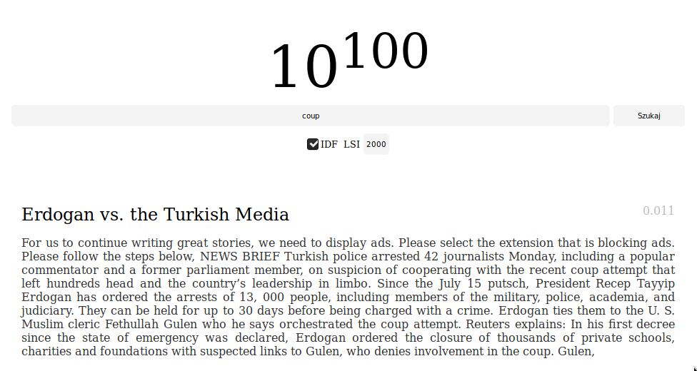

Maciej Mionskowski - 296628

------

# Wyszukiwarka 10<sup>100</sup>




## Dataset

[Kaggle.com - All The News](https://www.kaggle.com/snapcrack/all-the-news/downloads/all-the-news.zip/4)
- 10000 artykułów
- 40000 stemmów

## Technologie 

- PorterStemmer
- WordNet Lemmatizer
- normalizacja
- IDF
- LSI
- cosinusowa miara podobieństwa
- backend we Flasku
- compressed column sparse matrix
- frontend vanilla javascript

## Wnioski

- Przy wyłączonym IDF pokazuje się wiele krótkich, śmieciowych artykułów
- Skok przy IDF/LRA między 50 a 200 jest znaczący, natomiast między 200 a 2000 prawie niezauważalny
- SVD liczy się kilka minut (5) dla macierzy 10000x40000 
- czas wyszukiwania to koło 2 sekund

## Running

1. Download data set from link above, extract to articles.csv
2. Run:
```bash
pip install -r requirements.txt 
python endpoint.py
```
3. Wait for SVD to calculate, this will be done only once.