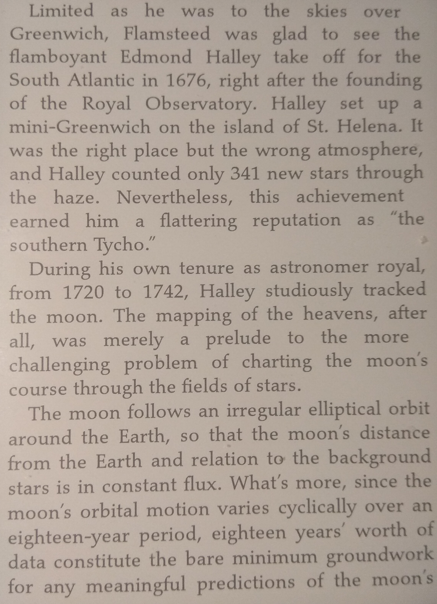
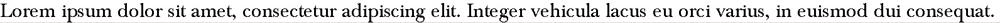
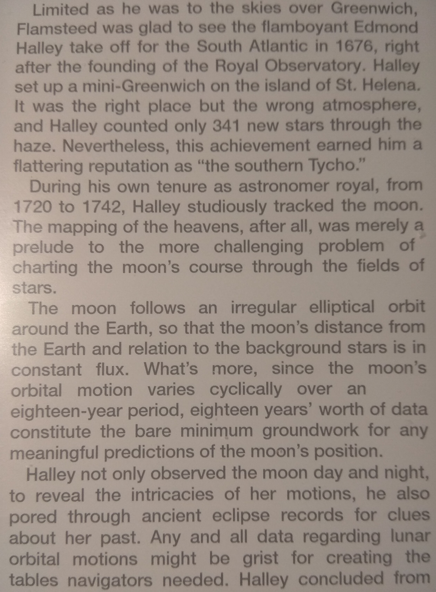
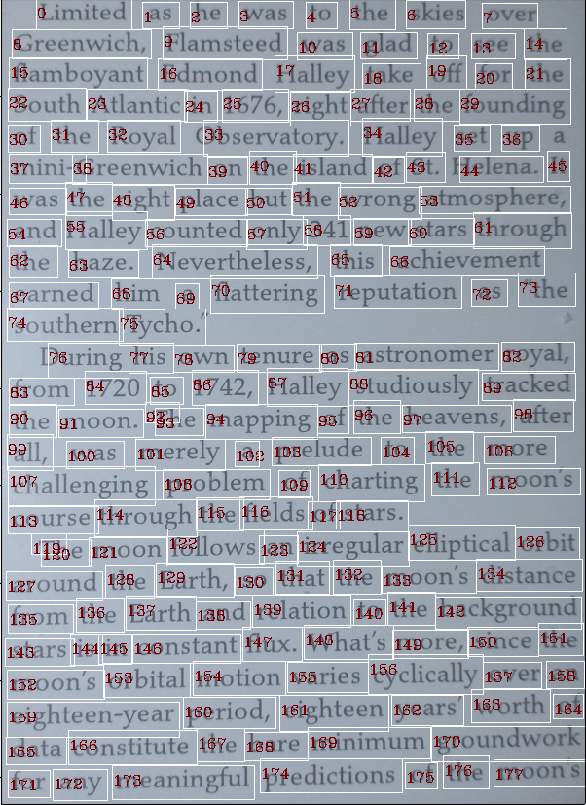
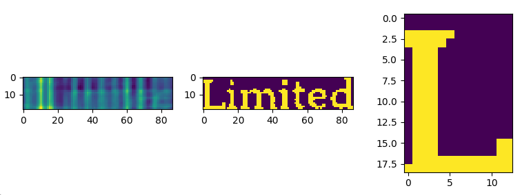

Maciej Mionskowski
296628
---

# 1. Analiza obrazów

## 1.1. Tekst

### Wynik

43 wystąpienia wzorca

### Wnioski

Zastosowanie twierdzenia o splocie na wzorcu i obrazie, w którym tego wzorca szukamy pozwala uzyskać stuprocentowe powodzenie poszukiwania wzorca (jeśli obraz wejściowy zawiera jego dokładne odwzorowanie, tak jak było w tym przypadku).

## 1.2. Ławica

### Wynik

Możemy zauważyć, że przy zdjęciu:
- nieregularnie oświetlonym
- o poszukiwanych wycinkach różnej wielkości
- zaszumieniu

Zastosowany algorytm bez preprocessingu nie zwraca zbyt dokładnych dopasowań.

## OCR

Do testów wykonałem kilka zdjęć z czytnika e-booków.

 Font: Baskerville
 Font: Baskerville
 Font: Helvetica

### Algorytm

1. Wczytaj font z ttfa, wyrenderuj wszystkie potrzebne znaki, przechowaj ich bitmapy w pamięci
2. Wczytaj obraz do OCRa, zamień go na czarnobiałą bitmapę
3. Wyciąganie słów:
    - Wyciągnij jasne elementy na ciemnym tle poprzez użycie transformacji tophat
    - Wzmocnij krawędzie wyliczając gradient (Sobel operator)
    - Rozmaż delikatnie powstały obraz aby uciąglić słowa
    - Wyszukaj krawędzie i oblicz ich bounding box
    - Heurystycznie posortuj wyszukane krawędzie, aby uzyskać odpowiednią kolejność słów 
4. Wyciąganie liter ze słów:
    - Poszukuj całej zerowej kolumny za literą 
5. Rozpoznawanie liter/wyrazów
    - Przy pierwszym podejściu wzorowałem się zadaniem 1., gdzie wyszukiwałem maksima poprzez operację splotu na całym wyrazie,
      jednak ta metoda dawała bardzo niekoherentne wyniki związane z niedokładnością fotografii. 
    - Przy drugim podejściu klasyfikację prowadziłem na pojedynczych literach, jednak i to nie dawało jakkolwiek czytelnego rezultatu.
    - Przy trzecim podejściu użyłem [template matchingu z opencv](https://docs.opencv.org/2.4/doc/tutorials/imgproc/histograms/template_matching/template_matching.html),
      gdzie najlepsze wyniki osiągnąłem używając metody `CV_TM_CCOEFF_NORMED`

### Obracanie obrazu wejściowego

Próbowałem zastosować transformatę fouriera do obracania obrazu do postaci horyzontalnej wzorując się na https://vh.io/articles/2018-06-15.html. Jednak o ile dla tekstu wygenerowanego działało to bardzo dobrze, to dla zdjęć nie działało w ogóle, ale obracało te dobrze obrócone. Dlatego też ten fragment kodu jest wykomentowany.

### Rezultat

Baskerville (szeryfowe) wygenerowane z fonta:
> Lorem ipsum dolor sit amet, consecmtur adipiscing elit. bmger vehicula lacus eu omi vaHus, in euismod dui conse9uat. mi9uam emt volutpat. In hac habitasse platea dicmmst. Hamus au!e jusO, mucibus a anm ac, phamtm aucOr lecms. Nullam eleimnd nunc in Ljusto cursus sed 9uis sem. Vestibulum ante ipsum pHmis in mucibus omi lucms et ulmces posuem cubilia Cumel In tincidunt vesubulum mmis sed ultHces. Q jis9ue semper est nunc, nec egest5 mi vulputam at. juis lacinia ante in dignissim vesubulum. Maecenas iaculis mollis augue, non laomet ne9ue dignissim vel. haesent ullamcomer hnibus uncidunt. %            

Helvetica (bezszeryfowa) wygenerowana z fonta:
> I Lorem ipsum dolor sit amet, consectetur adipiscing elit. Integer vehicula lacus eu orci varius, in euismod dui consequat. Aliquam erat volutpat. In hac habitasse platea dictumst. Vivamus augue justo, faucibus a ante ac, pharetra auctor lectus. Nullam eleifend nunc in justo condimentum cursus sed quis sem. Vestibulum ante ipsum primis in faucibus orci luctus et ultrices posuere cubilia Curae; In tincidunt vestibulum turpis sed ultrices. Quisque semper est nunc, nec egestas mi vulputate at. Duis lacinia ante in dignissim vestibulum. Maecenas iaculis mollis augue, non laoreet neque dignissim vel. Praesent ullamcorper finibus tincidunt. 

Zdjęcie baskerville:
> L1m.tcd as he was Io m. .htl . 6reenwIchf p1dmsIeed was dud lo ld ha Bamhoyani Edmond Hauey It d br h south At1anIic In 1676r r.ghl dher be ". of lhe RoyaJ ,hsewaIo!r Hau! nel ! min1at aCreentch on ihe .Sland or sI. 4.l" h Was the r1ghl p1ace buI Ihe !ong j.sp. dnd "a11eF c0unled 0nN 341 new slvs h. 1he hazel NeVerlhc1ossr Ihis acmcwm8 odrDed him a naHer1ng rcpuIau0n aS .me sOuthern PChoar jurIng b.s o, te"urc as asIronomer r. iOm 47z0 Io 1Z42Z Ha1lcy siud1ousw kJd cbo mOoni lL The mapp1nga of the htUnSJ .r d1lz was mere1y n prc1ude Io mt moR CbdlJeng.ng prob1om of chaH.ng me mooKs Cc,urse Ihr0ugh tho bc1ds or asIarsr Th Thc m0on .I10ws an irrc!1ar empucd dn drODnd Ihe EarIhJ so IhaI me moonfs disIEct 9om the Earlh and rclaI.on lo Ihe bac.o. sIdps 1s in constdnl n". .dlJs morcr smce m. m0on7s 0rb1Ia1 moI1on var.eS cvc1icMw Ger e cighIcenwedr per1odl c1.Iecn yearsj wo. d Odid c0nsliIulc Ibc barc minimum voun,a 1or dny mpanIn.I prcd1cI.ons or me m.. %  

### Materiały

- https://en.wikipedia.org/wiki/Top-hat_transform
- https://en.wikipedia.org/wiki/Sobel_operator
- https://vh.io/articles/2018-06-15.html
- https://stackoverflow.com/questions/37771263/detect-text-area-in-an-image-using-python-and-opencv
- https://www.pyimagesearch.com/2014/09/01/build-kick-ass-mobile-document-scanner-just-5-minutes/
- https://www.pyimagesearch.com/2017/07/17/credit-card-ocr-with-opencv-and-python/
